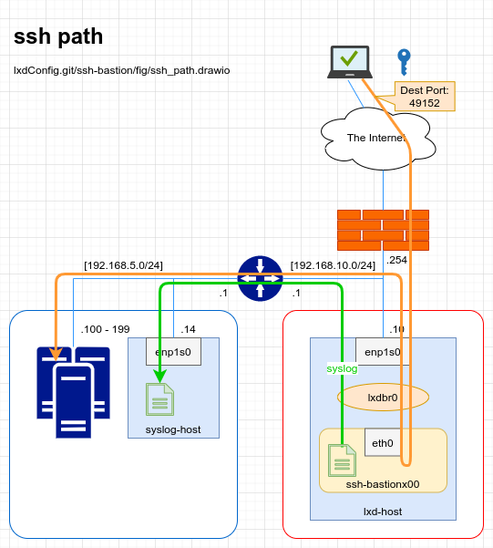

# Create ssh bastion Instance

## 概要
- 踏み台の性質上、別ホストからコンテナ方向への接続を確立させる必要が有る
  - proxy device を作成しホスト宛のパケットをコンテナにポートフォワーディングさせる
- 踏み台への接続ユーザの作成を `Cloud config` にて実施
  - `Cloud config` は `alpine-edge` または `alpine-3.13` 以降からサポート
  - `Cloud config` にて公開鍵の登録を行う
  - 踏み台としての利用なので `sudo` 権限は与えない
- 
## イメージの確認
- [Alpine Linux Packages](https://pkgs.alpinelinux.org/packages?name=cloud-init&branch=v3.13)
- [Currently available images](https://us.images.linuxcontainers.org/)
  - amd64(x86_64)
    ```bash
    $ lxc image list images: alpine 3.13 amd64
    ```
  - arm64(aarch64)
    ```bash
    $ lxc image list images: alpine 3.13 arm64
    ```

## Cloud config の作成
- env
  ```bash
  $ CONTAINER_NAME='ssh-bastionx00'
  $ LOGIN_USER_NAME='alpine'
  $ SSH_PUB_KEY_00='/path/to/dir/.ssh/id_ed25519_ssh-bastion.pub'
  $ SYSLOG_HOST='192.168.5.14'
  $ SYSLOG_PORT='514'
  ```
- edit
  ```bash
  $ cp -ip ./cloud-init_user-data.yaml{.example,}
  $ sed -i "s/%%CONTAINER_NAME%%/${CONTAINER_NAME}/" ./cloud-init_user-data.yaml
  $ sed -i "s/%%LOGIN_USER_NAME%%/${LOGIN_USER_NAME}/" ./cloud-init_user-data.yaml
  $ sed -i "s#%%SSH_PUB_KEY_00%%#$(cat ${SSH_PUB_KEY_00})#" ./cloud-init_user-data.yaml
  $ sed -i "s/%%SYSLOG_HOST%%/${SYSLOG_HOST}/" ./cloud-init_user-data.yaml
  $ sed -i "s/%%SYSLOG_PORT%%/${SYSLOG_PORT}/" ./cloud-init_user-data.yaml
  $ diff -us ./cloud-init_user-data.yaml{.example,}
  ```

## コンテナを生成
- lxc init  
  `--config` オプションを付けて Cloud config を適用したコンテナを生成
  ```bash
  $ lxc init images:alpine/3.13/cloud ${CONTAINER_NAME} --config=user.user-data="$(cat ./cloud-init_user-data.yaml)"
  ```
  - memo
    ```bash
    $ lxc init images:alpine/3.13/cloud ${CONTAINER_NAME}
    $ lxc config set ssh-bastionx03 user.user-data - < cloud-init_user-data.yaml
    $ lxc config set ssh-bastionx03 user.network-config - < cloud-init_network-config.yaml
    $ lxc config show ssh-bastionx03
    (..snip..)
      user.network-config: |+
        #cloud-config
    
        network:
          version: 1
          config:
    (..snip..)
      user.user-data: |+
        #cloud-config
    
        hostname: ssh-bastionx00.lxdbr0.internal
        preserve_hostname: false
        manage_etc_hosts: true
    (..snip..)
    ```

- コンテナの生成を確認  
  `STATE: STOPPED` であること。
  ```bash
  $ lxc ls
  +----------------+---------+------+------+-----------+-----------+
  |      NAME      |  STATE  | IPV4 | IPV6 |   TYPE    | SNAPSHOTS |
  +----------------+---------+------+------+-----------+-----------+
  | ssh-bastionx00 | STOPPED |      |      | CONTAINER | 0         |
  +----------------+---------+------+------+-----------+-----------+
  ```
- イメージの確認  
  初回のみイメージのダウンロードが実行される。
  ```bash
  $ lxc image ls
  +-------+--------------+--------+------------------------------------+--------------+-----------+---------+-------------------------------+
  | ALIAS | FINGERPRINT  | PUBLIC |            DESCRIPTION             | ARCHITECTURE |   TYPE    |  SIZE   |          UPLOAD DATE          |
  +-------+--------------+--------+------------------------------------+--------------+-----------+---------+-------------------------------+
  |       | 85972c8bb3d8 | no     | Alpine 3.13 amd64 (20210226_13:00) | x86_64       | CONTAINER | 17.05MB | Feb 27, 2021 at 12:14pm (UTC) |
  +-------+--------------+--------+------------------------------------+--------------+-----------+---------+-------------------------------+
  ```

## ポートフォワーディング
- ネットワーク設定の固定化  
  ポートフォワーディングが可能な様にサブネットを固定する。
  ```bash
  $ lxc network set lxdbr0 bridge.hwaddr 00:16:3e:33:64:01
  $ lxc network set lxdbr0 dns.domain lxdbr0.internal
  ```
  ```bash
  $ lxc network set lxdbr0 ipv4.address 198.51.100.1/24
  $ lxc network set lxdbr0 ipv4.dhcp.gateway 198.51.100.1
  $ lxc network set lxdbr0 ipv4.dhcp.ranges 198.51.100.129-198.51.100.190
  ```
  ```bash
  $ lxc network set lxdbr0 ipv6.address 2001:db8::1/64
  $ lxc network set lxdbr0 ipv6.dhcp.stateful true
  $ lxc network set lxdbr0 ipv6.dhcp.ranges 2001:db8::ffff:1000-2001:db8::ffff:fffe
  ```
  ```bash
  $ lxc network show lxdbr0
  ```
- IPアドレスの固定化  
  ポートフォワーディングが可能な様にコンテナへ払い出すIPアドレスを固定する。
  ```bash
  $ lxc network attach lxdbr0 ${CONTAINER_NAME} eth0 eth0
  $ lxc config device set ${CONTAINER_NAME} eth0 ipv4.address 198.51.100.22
  ```
  ```bash
  $ lxc config device set ${CONTAINER_NAME} eth0 ipv6.address 2001:db8::22
  $ lxc config device show ${CONTAINER_NAME}
  eth0:
    ipv4.address: 198.51.100.22
    ipv6.address: 2001:db8::22
    name: eth0
    network: lxdbr0
    type: nic
  ```
- list-leases  
  設定後は `TYPE: STATIC` であること。
  ```bash
  $ lxc network list-leases lxdbr0
  +----------------+-------------------+---------------+--------+
  |    HOSTNAME    |    MAC ADDRESS    |  IP ADDRESS   |  TYPE  |
  +----------------+-------------------+---------------+--------+
  | ssh-bastionx00 | 00:16:3e:33:64:22 | 198.51.100.22 | STATIC |
  +----------------+-------------------+---------------+--------+
  | ssh-bastionx00 | 00:16:3e:33:64:22 | 2001:db8::22  | STATIC |
  +----------------+-------------------+---------------+--------+
  ```
- proxy device
  - LXD 4系
    ```bash
    $ lxc config device add ${CONTAINER_NAME} proxy-tcp49152v4 proxy listen=tcp:<LXD host IP Addr>:49152 connect=tcp:198.51.100.22:22 nat=true
    Device proxy-tcp49152 added to ssh-bastionx00
    $ lxc config device show ${CONTAINER_NAME}
    eth0:
      ipv4.address: 198.51.100.22
      name: eth0
      nictype: bridged
      parent: lxdbr0
      type: nic
    proxy-tcp49152:
      connect: tcp:198.51.100.22:22
      listen: tcp:<LXD host IP Addr>:49152
      nat: "true"
      type: proxy
    ```
  - LXD 3系
    ```bash
    $ lxc config device add ${CONTAINER_NAME} proxy-tcp49152 proxy listen=tcp:<LXD host IP Addr>:49152 connect=tcp:198.51.100.22:22 bind=host
    Device proxy-tcp49152 added to ssh-bastionx00
    $ lxc config device show lxd-bastionx02
    eth0:
      ipv4.address: 198.51.100.22
      name: eth0
      nictype: bridged
      parent: lxdbr0
      type: nic
    proxy-tcp49152:
      bind: host
      connect: tcp:198.51.100.22:22
      listen: tcp:<LXD host IP Addr>:49152
      type: proxy
    ```
    ```bash
    $ sudo iptables --append INPUT --in-interface enp1s0 --match conntrack --ctstate NEW --match tcp --protocol tcp --dport 49152 --jump ACCEPT
    ```

## コンテナの起動
- コンテナの起動
  ```bash
  $ lxc start ${CONTAINER_NAME}
  ```
- proxy device の確認(LXD 4系)
  ```bash
  $ sudo iptables -nvL PREROUTING --table nat --line-numbers | grep -E "(^Chain|^num|dpt:49152)"
  Chain PREROUTING (policy ACCEPT 411 packets, 76622 bytes)
  num   pkts bytes target     prot opt in     out     source               destination         
  1        0     0 DNAT       tcp  --  *      *       0.0.0.0/0            <LXD host IP Addr>   tcp dpt:49152 /* generated for LXD container ssh-bastionx00 (proxy-tcp49152) */ to:198.51.100.22:22
  ```

## Cloud config の適用を確認
- ユーザの作成
  ```bash
  $ lxc exec ${CONTAINER_NAME} -- grep alpine /etc/passwd
  alpine:x:1000:1000::/home/alpine:/bin/ash
  ```
- 公開鍵の登録
  ```bash
  $ lxc exec ${CONTAINER_NAME} -- cat /home/alpine/.ssh/authorized_keys
  ssh-ed25519 AAAA(..snip..)ZZZZ alpine@container.internal
  ```
- sshd の起動
  ```bash
  $ lxc exec ${CONTAINER_NAME} -- ps -aef | grep sshd
    621 root      0:00 sshd: /usr/sbin/sshd [listener] 0 of 10-100 startups
  ```
- sshd の自動起動
  ```bash
  $ lxc exec ${CONTAINER_NAME} -- sh -c 'rc-status | grep sshd'
   sshd                                                             [  started  ]
  ```
- ssh 接続確認(公開鍵認証)  
  成功すること。
  ```bash
  $ ssh -i ~/.ssh/id_ed25519.pem -l alpine 198.51.100.22
  (..snip..)
  Are you sure you want to continue connecting (yes/no/[fingerprint])? yes
  Enter passphrase for key '/home/<use_name>/.ssh/id_ed25519_ssh-bastion.pem': 
  Welcome to Alpine!
  (..snip..)
  ssh-bastionx00:~$ 
  ```
- ssh 接続確認(パスワード認証)  
  失敗すること。
  ```bash
  $ ssh -l alpine 198.51.100.22
  alpine@198.51.100.22: Permission denied (publickey).
  ```
- 接続確認(ポートフォワード)  
  他ホストから接続が可能であること。
  ```bash
  $ ssh -i ~/.ssh/id_ed25519_ssh-bastion.pem -l alpine <LXD host IP Addr> -p 49152
  ```

## コンテナの停止と削除
- コンテナの停止
  ```bash
  $ lxc stop ${CONTAINER_NAME}
  ```
- コンテナの削除
  ```bash
  $ lxc delete ${CONTAINER_NAME}
  ```

## Example: ~/.ssh/config
```shell
Host ssh-bastionx00
    HostName 192.168.10.10
    Port 49152
    User alpine
    IdentityFile ~/.ssh/id_ed25519_ssh-bastion.pem

Host develop
    HostName 192.168.5.100
    Port 22
    User Alice
    IdentityFile ~/.ssh/id_ed25519_alice.pem
    ProxyCommand ssh ssh-bastionx00 -W %h:%p
```
